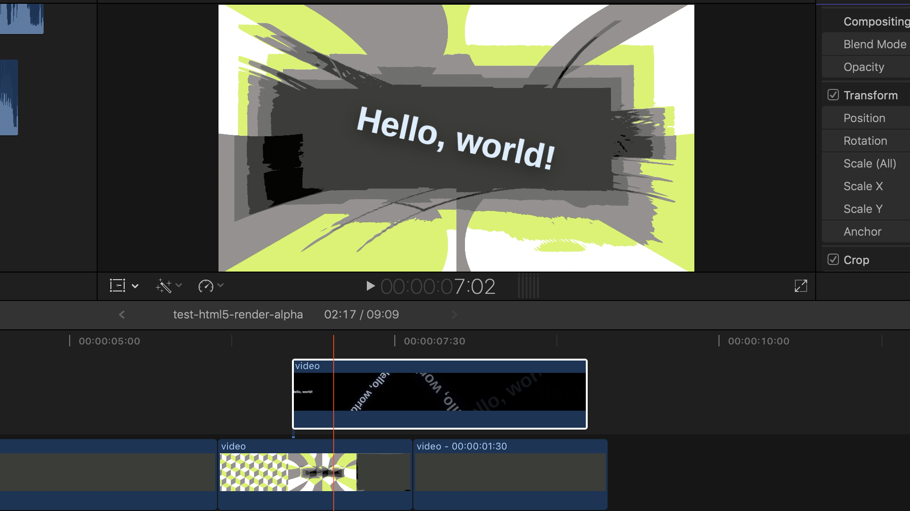

# html5-animation-video-renderer

[**Watch the introduction video**](https://www.youtube.com/watch?v=zaSYWktDkAQ)

A Node.js script that renders an HTML5-based animation into a high-quality video (supports at least 1080p60).
It renders the animation in a frame-by-frame basis using Puppeteer.
So, even very CPU-intensive animations can be rendered without skipping frames (unlike screen recording solutions).

It works by opening a headless browser and calls `seekToFrame(frameNumber)` for each frame of your animation.
When called, your web page is expected to display that frame on the screen so that a screenshot for that frame can be taken.
Each frame is then sent to `ffmpeg` to encode the video without needing to save temporary files to disk.
Because it works by capturing the page screenshot, it can render:

- HTML elements
- SVG elements
- Canvas
- WebGL

However, the renderer needs to be able to display a freeze frame when requested. Therefore, it does not support:

- CSS animations and transitions
- Nondeterministic animations

Features:

- **Outputs high-quality MP4 file** with configurable frame rate and size.
- **Outputs PNG image frames** with the `--png` flag.
- **Framework-agnostic,** so you can use it with GSAP, Pixi.js, Vue.js, React.js, etc. See examples below!
- **Parallizable** — It can run multiple instances of headless Chrome in parallel to speed up rendering.
- **Video with alpha channel** can be rendered using the `--transparent` option.
  It outputs as a QuickTime Animation (.mov) file.

## Examples and demos

All videos and preview images here are [generated by CircleCI](.circleci/config.yml) [on every commit](https://circleci.com/gh/dtinth/html5-animation-video-renderer/tree/master).

<table>
<thead>
  <tr>
    <th>&nbsp;&nbsp;&nbsp;&nbsp;&nbsp;Image&nbsp;&nbsp;&nbsp;&nbsp;&nbsp;</th>
    <th>Source code</th>
    <th>View in browser</th>
    <th>Result</th>
  </tr>
</thead>
<tbody>
  <tr>
    <td rowspan="2" align="center"></td>
    <td><a href="examples/gsap-hello-world.html">examples/gsap-hello-world.html</a></td>
    <td><a href="https://raw.githack.com/dtinth/html5-animation-video-renderer/master/examples/gsap-hello-world.html">🌏 View</a></td>
    <td><a href="https://latest-circleci-artifacts.lovely.workers.dev/github/dtinth/html5-animation-video-renderer/master/output/gsap-hello-world.mp4">🎬 Play (1080p60)</a></td>
  </tr>
  <tr>
    <td colspan="3">
      <strong>A simple but CPU-intensive Hello World example using GSAP.</strong>
      Shows basic usage on how to create an HTML5 webpage compatible with this renderer.
    </td>
  </tr>
  <tr>
    <td rowspan="2" align="center"></td>
    <td><a href="examples/vue-starfield.html">examples/vue-starfield.html</a></td>
    <td><a href="https://raw.githack.com/dtinth/html5-animation-video-renderer/master/examples/vue-starfield.html">🌏 View</a></td>
    <td><a href="https://latest-circleci-artifacts.lovely.workers.dev/github/dtinth/html5-animation-video-renderer/master/output/vue-starfield.mp4">🎬 Play (1080p60)</a></td>
  </tr>
  <tr>
    <td colspan="3">
      <strong>A very CPU-intensive starfield built with Vue.js.</strong>
      When viewed in real-time, my Late 2013 MacBook Pro cannot render any faster than 10 fps.
    </td>
  </tr>
</tbody>
</table>

## Creating your HTML5 animation

Your HTML5-based animation can be created using any tool, so long as the webpage has these properties:

- The webpage should contain a `#scene` element in the DOM, positioned at `top: 0; left: 0;`.
  The dimensions of the `#scene` element will be the video’s dimensions.
  You can use the provided [lib/style.css](lib/style.css) as a starting point.

- The webpage should contain these global JavaScript functions:

  - **`getInfo()`** should return an object with the following properties:

    - `fps` The video frame rate.
    - `numberOfFrames` The number of frames to render.

  - **`seekToFrame(frameNumber)`** should display the frame at the specified `frameNumber`.
    This function may return a promise, in this case the renderer will wait for it to resolve.
    Please make sure that all assets (such as images/fonts) are already loaded.

    If `seekToFrame()` returns (or resolves to) a string begining with `data:image/png;base64,`,
    then the renderer directly renders the PNG image instead of taking a screenshot.
    This can really speed up rendering by an order of magnitude.

  See an example at [examples/gsap-hello-world.html](examples/gsap-hello-world.html).

## Install the prerequisites

Install Node.js 12, Yarn and ffmpeg, then install the project dependencies with:

```
yarn install
```

## Running the renderer

To see help text, run:

```
node render --help
```

### Rendering a video

```
node render --url=<URL> --video=<FILE>.mp4
```

### Controlling parallelism

By default, the renderer will spawn multiple headless Chrome processes matching the number of CPU cores detected on your machine.
However, more running Chrome instances means more memory consumption.
This may be undesirable.

For instance, CircleCI instances have 2 vCPUs and 4 GB of RAM.
However it reports as having 36 cores, leading to a lot of crashes due to out-of-memory condition.

You can control the number of headless Chrome processes using the `--parallelism` option:

```
node render --url=<URL> --video=<FILE>.mp4 --parallelism=4
```

### Render as image files instead

You can also render individual frames as different image files using the `--png` option.
This can help you avoid losing your work in case you want to render a long video, in exchange for more disk usage.

```
node render --url=<URL> --video=<FILE>.mp4 --png=<DIR>
```

This will render each frame to `<DIR>/frameNNNNNN.png`.
Note that you will have to assemble these frames into a video file yourself.
You can use this in conjunction with `--no-video` to render just the image files, without the video.

### Render only some part of the video

You can also set the starting and ending frame numbers.

```
node render --url=<URL> --video=<FILE>.mp4 --start=60 --end=120
```

This will render the frames 60–119. Note that the ending frame is not rendered.

### Do not render a video

Use the `--no-video` option. Useful when used with `--png`.

```
node render --url=<URL> --no-video
```

### Render a single frame

Just set `--end` to (`--start` + 1) and render out a `--png` file.

```
node render --url=<URL> --png=<DIR> --start=60 --end=61
```

### Upscale/downscale the viewport

Use the `--scale` option to scale up or scale down the browser viewport.

```
node render --url=<URL> --video=<FILE>.mp4 --scale=0.5
node render --url=<URL> --video=<FILE>.mp4 --scale=2
```

### Render alpha channel

You can also use this tool to render animations with alpha channel passing the `--alpha` option and outputting a `.mov` file.
Note that the resulting file size will be significantly larger due to codec change (QuickTime Animation codec)!

```
node render --url=<URL> --video=<FILE>.mov --alpha
```

This allows you to composite the rendered animation on top of another video file!



<!--
## Demo

TODO add video

It has been used to render a 4-minute long 1080p60 video. That’s 15000 frames.
The speed on my Late 2013 MacBook Pro is around 4.5 frames per second.

```
frame=15000 fps=4.5 q=-1.0 Lsize=  644441kB time=00:04:09.98 bitrate=21118.5kbits/s speed=0.0758x
video:644374kB audio:0kB subtitle:0kB other streams:0kB global headers:0kB muxing overhead: 0.010475%
``` -->
